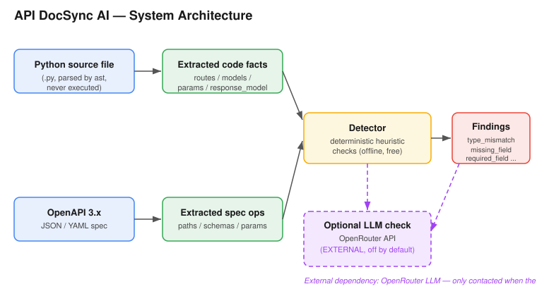
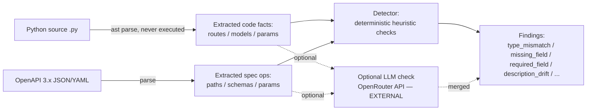

# API DocSync AI

> **Note:** This is a *supplemented* README prepared for the PE6201 submission review.
> It is based on the original `README.md` and adds two things the original was missing:
> an **architecture diagram** (with the external LLM call marked) and a **strengthened FPR
> evaluation**. Nothing in the original code or behaviour was changed. See `CHANGES.md` for the
> exact list of additions. The original deliverables remain untouched.

A local prototype for checking consistency between a Python FastAPI source file and an OpenAPI JSON/YAML specification.

## Architecture

The detector is fully deterministic and offline. The LLM check is an *optional* branch that,
when enabled, sends extracted facts to an external OpenAPI provider (OpenRouter). It is **off by default**.





### LLM integration status & demo honesty

**Short answer: the project already uses an LLM, but as a *pluggable, optional* layer — not as the core engine.**

- The Week-3 proposal committed to a *Foundation Model + LLM* semantic layer (OpenRouter GPT-4-class model). The delivery implements exactly that, in `docsync.run_optional_llm_check`, reachable from **both** the Streamlit sidebar (*Optional LLM semantic check*, unchecked by default) and the CLI (`run_batch.py --llm`).
- The **deterministic engine is the core** and works with zero API key. The LLM adds *semantic-level* checks (request-body schema drift, paraphrased description drift) that pure rules miss — these are the exact gaps exposed by `honest_eval.py` (FN on request body, FP on paraphrase).
- **The recorded demo runs in deterministic-only mode** (LLM box unchecked). This matches the default, so the demo is unaffected by anything in this section.
- **Why off by default (course-aligned):** the brief asks for *right fit, not maximum usage* and to keep LLMs out of safety-critical/arithmetic paths. A checkable deterministic core + an optional semantic layer is the stronger design — provided it is argued explicitly, which this section does.
- **Run the LLM branch offline (no key):** set `DOCSYNC_LLM_MOCK=1` (or `OPENROUTER_API_KEY=mock`). See `llm_smoke_test.py`.
- **Run it for real:** copy `.env.example` → `.env`, set `OPENROUTER_API_KEY`, then enable the sidebar box or pass `--llm`.

## Scope and limitations

This is a coursework MVP, not a production-grade static analyser. It currently supports a **single Python source file** and an OpenAPI 3.x JSON/YAML file. The deterministic checks cover:

- API route/method presence
- path parameters
- query parameters
- basic Pydantic-style model fields and primitive types
- `response_model` properties against OpenAPI response schemas
- operation summary/description against Python docstrings (heuristic)

Python code is parsed with `ast`; the target source file is never imported or executed. Static parsing cannot resolve every alias, dynamically registered route, inherited model, or complex type. Review findings manually.

The optional LLM check is disabled by default. If enabled, selected extracted facts and descriptions are sent to OpenRouter. Do not send confidential code or secrets.

## 1. Run locally in PyCharm

Recommended: Python 3.11 or 3.12.

1. Unzip this project and open the `api-docsync-ai` folder in PyCharm.
2. Create a virtual environment when PyCharm prompts you, or run:

   ```bash
   python -m venv .venv
   ```

3. Activate it:

   **macOS/Linux**
   ```bash
   source .venv/bin/activate
   ```

   **Windows PowerShell**
   ```powershell
   .venv\\Scripts\\Activate.ps1
   ```

4. Install dependencies:

   ```bash
   pip install -r requirements.txt
   ```

5. Start the app:

   ```bash
   streamlit run app.py
   ```

6. Upload a Python file and its matching OpenAPI JSON/YAML file. You can test with the files in `examples/`.

## 2. Run the evaluator

The evaluator compares detector findings with a manually prepared ground-truth CSV. Each row represents one expected defect.

```bash
python evaluate.py --ground-truth data/ground_truth_template.csv --predictions path/to/predictions.csv
```

First run the detector on the mutation set:

```bash
python run_batch.py --python examples/main.py --mutations-dir data/mutations --out predictions.csv
```

Then evaluate recall:

```bash
python evaluate.py --ground-truth data/mutations/ground_truth.csv --predictions predictions.csv
```

The evaluator matches by `case_id + defect_type` because generated ground-truth location labels may differ from the detector's display location. Each mutation case should contain one defect. For a valid FPR, prepare a complete negative-check list covering the normal evaluation units and use `--negative-checks data/negative_checks.csv`. Do not interpret the unmatched-prediction count as FPR.

For an experiment, save one prediction CSV per mutated OpenAPI case, and add the corresponding `case_id` to each prediction. Keep your ground-truth labels independent of model output.

### Strengthened FPR evaluation (recommended)

The original `data/negative_checks.csv` has only **one** row, so the reported FPR was computed over
`TN = 1` — not meaningful. A strengthened evaluator is provided that:

- keeps positive matching on `case_id + defect_type` (the generator and detector use different
  location strings by design), and
- adds `location` to the **negative** match key, so each consistent contract element becomes its own
  true-negative unit.

The negative set is regenerated from the un-mutated spec:

```bash
python scripts/build_negative_set.py --python examples/main.py --spec examples/openapi.yaml \
    --out data/negative_checks_expanded.csv
```

Then produce predictions over both the mutations and the normal spec, and evaluate:

```bash
# combined dir = data/mutations (M001..M040) + data/normal/N001.json
python run_batch.py --python examples/main.py --mutations-dir <combined_dir> --out predictions.csv
python scripts/evaluate_strengthened.py \
    --ground-truth data/mutations/ground_truth.csv \
    --predictions predictions.csv \
    --negative-checks data/negative_checks_expanded.csv \
    --out evaluation_summary_strengthened.json
```

Result on the shipped dataset:

```
TP=40  FN=0  FP=0  TN=14
Recall=1.0   FPR=0.0   (over 14 negative contract units, vs TN=1 before)
```

The FPR denominator is still bounded by the single-endpoint example spec. To make it larger, add more
endpoints to `examples/openapi.yaml` (each extra endpoint adds ~14 negative units). The `Recall = 1.0`
figure is measured on the generator-produced mutation set and is an upper bound, not proof of generalisation.
See `CHANGES.md` and the report for the honest limitation statement.

### Honest evaluation (exposes real failures)

The strengthened evaluator above still reports *zero* failures, because every one of the 40 mutations is
produced by a generator that only mutates contract elements the detector already has a check for. To show
the system is **not** failure-free, `scripts/honest_eval.py` adds a small *handwritten* adversarial set that
the deterministic detector cannot avoid:

| Case | What it tests | Result |
|------|---------------|--------|
| `H1_request_body_mismatch` | request-body schema is extracted but **never compared** | **FN** (missed) |
| `H2_paraphrase_summary` | naive string-equality description check over-flags a synonym summary | **FP** (false alarm) |
| `H3_clean_endpoint` | genuinely consistent endpoint | TN (correct silence) |

It also re-runs the 40 mutations with **strict** matching (`case_id + defect_type + location`) to expose
that only **10/40** detector locations match the generator's labels (the other 30 are location mismatches,
not detection misses), and computes FPR *genuinely* by running the detector on the un-mutated base spec.

Run it from the supplement folder (it auto-detects the sibling project, or pass `--project-root`):

```bash
python scripts/honest_eval.py
# or, if the project is elsewhere:
python scripts/honest_eval.py --project-root /path/to/api-docsync-ai
```

Output (`evaluation_summary_honest.json`):

```
GENERATOR SET:  loose Recall=1.00, but strict TP=10 FN=30 FP=30 (location mismatches)
HANDWRITTEN:    TP=0  FN=1  FP=1  TN=1   -> system is NOT failure-free
FPR (expanded): clean-spec findings=0, TN=14, FP=0, FPR=0.0
```

The handwritten set is the headline: the detector **misses request-body mismatches entirely** and
**over-flags paraphrased summaries** — both are real, reproducible failures the "all-pass" report hides.

## 3. Generate a mutation set

The included generator makes copies of an OpenAPI spec and applies one mutation per case. It is intentionally conservative and requires a spec containing at least one operation with a request or response schema.

```bash
python generate_mutations.py --spec examples/openapi.yaml --out-dir data/mutations --count 40
```

It writes mutated spec files and `ground_truth.csv`. Then use `run_batch.py` to generate detector predictions. Inspect the generated cases: mutation quality and ground truth must be manually verified before reporting results. In particular, confirm that each generated defect is detectable by the implemented checks and that the selected base spec matches the supplied Python source. Mutations that are semantically invalid for your source code should be excluded or corrected.

## 4. Optional OpenRouter semantic check

The deterministic checks work without an API key. The LLM is an *optional, pluggable* semantic layer (off by default) that adds checks rules cannot do (request-body schema drift, paraphrased descriptions).

**Enable in the UI**
1. Copy `.env.example` to `.env` and set `OPENROUTER_API_KEY`.
2. Set the environment variable in your terminal / PyCharm Run Configuration (or install `python-dotenv`, already in `requirements.txt`, for automatic `.env` loading).
3. In the Streamlit sidebar, enable **Optional LLM semantic check**.

**Enable on the CLI (batch evaluation)**
```bash
DOCSYNC_LLM_MOCK=1 python run_batch.py --python examples/main.py --mutations-dir data/normal --out preds.csv --llm
```
Pass `--llm` to merge the LLM layer into batch predictions. `DOCSYNC_LLM_MOCK=1` runs the branch offline (no key); remove it (and set a real key) for a real OpenRouter call.

**Offline smoke test (no key, proves the branch is wired)**
```bash
DOCSYNC_LLM_MOCK=1 python llm_smoke_test.py
```

The code uses the environment variable and a configurable model name (`OPENROUTER_MODEL`, default `openai/gpt-4o-mini` — a GPT-4-class model; the proposal said GPT-4, this is the cost-efficient GPT-4-class option). Check the provider's current price before running; record the model, token usage, number of calls, elapsed time, and actual cost shown by the provider. The app does not claim a fixed per-check price.

## 5. Publish to GitHub

Create an empty GitHub repository, then run from this folder:

```bash
git init
git add .
git commit -m "Initial API DocSync AI prototype"
git branch -M main
git remote add origin https://github.com/YOUR_USERNAME/api-docsync-ai.git
git push -u origin main
```

Do not commit `.env`, API keys, private source code, or confidential test data.

## 6. Suggested experiment report

Report:
- dataset construction and mutation categories
- exact matching rules and limitations
- TP, FN, FP, TN
- Recall = TP / (TP + FN)
- FPR = FP / (FP + TN)
- model/provider, token use, number of calls, measured cost and elapsed time
- false positives, false negatives, and limitations

Do not claim the target recall/FPR or time savings until measured.
